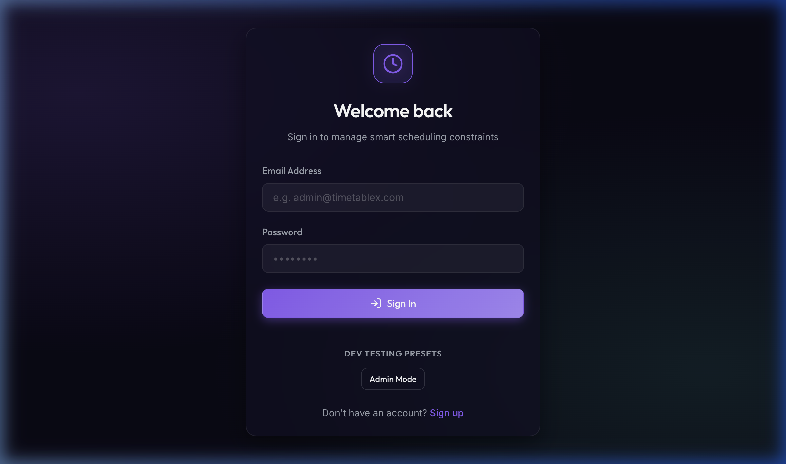
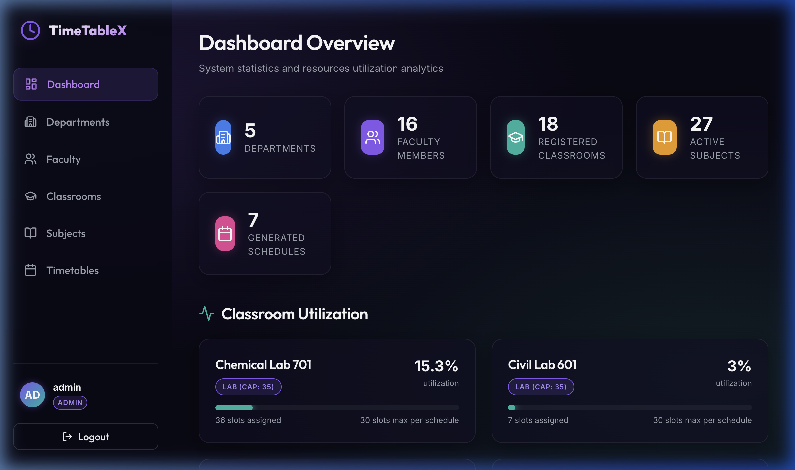
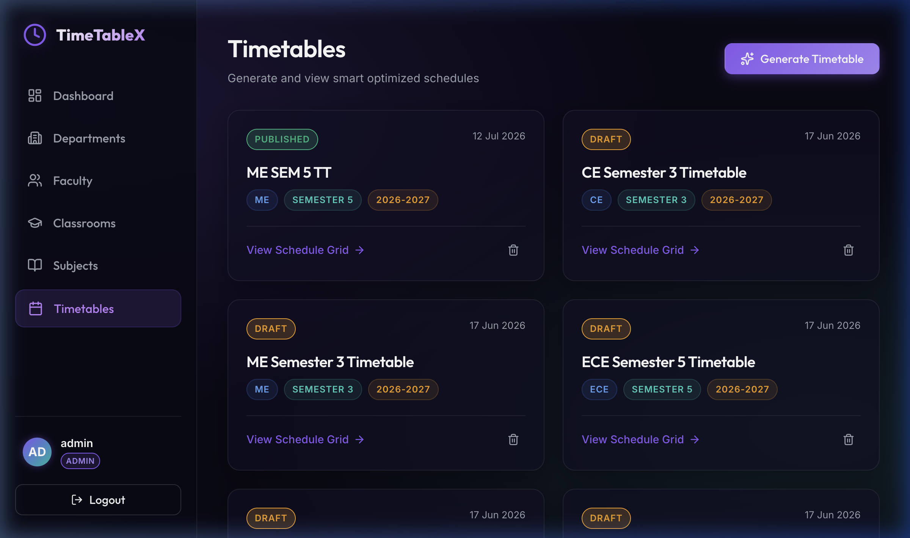
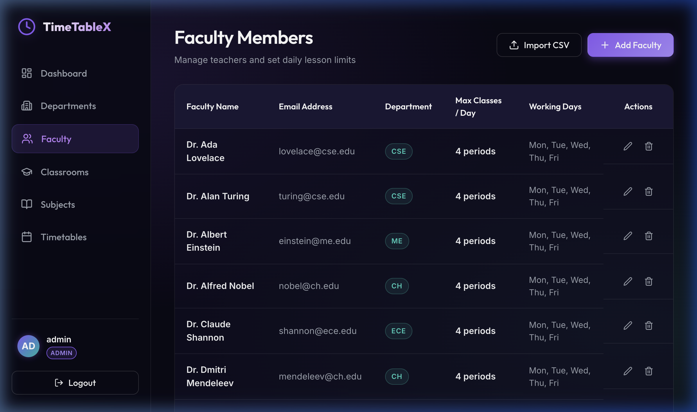

<div align="center">

# ⚡ TimeTableX

### Smart Timetable Optimization System

*Constraint-based academic scheduling powered by Google OR-Tools CP-SAT*

[](https://nodejs.org)
[](https://react.dev)
[](https://fastapi.tiangolo.com)
[](https://www.postgresql.org)
[](https://developers.google.com/optimization)

</div>

---

## 📋 Table of Contents

- [Overview](#-overview)
- [Architecture](#-architecture)
- [Tech Stack](#-tech-stack)
- [Screenshots](#-screenshots)
- [Prerequisites](#-prerequisites)
- [Setup & Installation](#-setup--installation)
- [Environment Variables](#-environment-variables)
- [Running the Services](#-running-the-services)
- [API Reference](#-api-reference)
- [Project Structure](#-project-structure)

---

## 🎯 Overview

TimeTableX is a full-stack, three-service application that **automatically generates conflict-free academic timetables** using constraint programming. It handles:

- 🏛️ **Multi-department scheduling** across semesters
- 👨‍🏫 **Faculty availability & load balancing** (max classes per day, working days)
- 🔬 **Lab batch splitting** (B1 / B2 / B3 … Bn) with co-faculty distribution
- 🏫 **Classroom capacity & type matching** (theory halls vs. lab rooms)
- 📅 **Configurable working days, periods per day, break slots, and slot duration**
- 📊 **CSV export** of any generated timetable
- 🔐 **JWT-secured REST API** with role-based access (admin / viewer)

---

## 🏗️ Architecture

```
┌─────────────────────────────────────────────────────────────────────┐
│                          User's Browser                             │
│                                                                     │
│   ┌────────────────────────────────────────────────────────────┐   │
│   │            Frontend  (React + Vite)                        │   │
│   │            http://localhost:5173                           │   │
│   │                                                            │   │
│   │  • React 19 + React Router DOM                            │   │
│   │  • Lucide Icons  •  Axios  •  Vanilla CSS                 │   │
│   │  • Pages: Dashboard, Departments, Faculty, Classrooms,    │   │
│   │           Subjects, Timetables, Timetable Detail          │   │
│   └────────────────┬───────────────────────────────────────────┘   │
└────────────────────┼────────────────────────────────────────────────┘
                     │  REST / JSON  (JWT Bearer token)
                     ▼
┌────────────────────────────────────────────────────────────────────┐
│              Backend API  (Express.js + Sequelize)                 │
│              http://localhost:5001                                 │
│                                                                    │
│  Routes: /api/auth  /api/departments  /api/faculty                │
│          /api/subjects  /api/classrooms  /api/timetables          │
│          /api/dashboard  /api/import                              │
│                                                                    │
│  • Helmet + rate-limiting  • express-validator  • bcryptjs/JWT    │
│  • Sequelize ORM → PostgreSQL (Users, Departments, Faculty,       │
│    Subjects, Classrooms, Timetables, TimetableEntries,            │
│    SubjectFaculty)                                                │
│                                  │                                │
│                 POST /api/v1/optimize (JSON payload)              │
│                                  │                                │
│               ┌──────────────────▼──────────────────┐            │
│               │   Optimizer  (FastAPI + OR-Tools)   │            │
│               │   http://localhost:8000              │            │
│               │                                      │            │
│               │  • FastAPI + Uvicorn                 │            │
│               │  • Pydantic v2 request/response      │            │
│               │  • Google OR-Tools CP-SAT solver     │            │
│               │  • scheduler.py  (constraint model)  │            │
│               └──────────────────────────────────────┘            │
│                                                                    │
└─────────────────────────────────┬──────────────────────────────────┘
                                  │  Sequelize / pg
                                  ▼
                     ┌────────────────────────┐
                     │   PostgreSQL  :5432     │
                     │   Database: timetablex  │
                     └────────────────────────┘
```

### Data Flow — Timetable Generation

```
Browser                Backend                     Optimizer (Python)
  │                       │                               │
  │  POST /timetables/generate                            │
  │──────────────────────►│                               │
  │                       │  Fetch subjects + faculty     │
  │                       │  from PostgreSQL              │
  │                       │◄──────────────────────────────│ (DB)
  │                       │                               │
  │                       │  POST /api/v1/optimize        │
  │                       │──────────────────────────────►│
  │                       │                               │ CP-SAT solve
  │                       │        schedule[]             │
  │                       │◄──────────────────────────────│
  │                       │                               │
  │                       │  Persist Timetable +          │
  │                       │  TimetableEntries (atomic tx) │
  │                       │                               │
  │  201 { data: timetable}                               │
  │◄──────────────────────│                               │
```

---

## 🛠️ Tech Stack

| Layer | Technology |
|---|---|
| **Frontend** | React 19, Vite 8, React Router DOM 7, Axios, Lucide React |
| **Backend** | Node.js 20+, Express 4, Sequelize 6, PostgreSQL 16 |
| **Optimizer** | Python 3.11+, FastAPI, Uvicorn, Google OR-Tools (CP-SAT), Pydantic v2 |
| **Auth** | JWT (jsonwebtoken), bcryptjs |
| **Security** | Helmet, express-rate-limit, express-validator |
| **Dev Tools** | Nodemon, Concurrently, ESLint, pytest |

---

## 📸 Screenshots

### Login


### Dashboard


### Timetables


### Faculty Management


---

## ✅ Prerequisites

Make sure these are installed on your machine before proceeding:

| Tool | Version | Notes |
|---|---|---|
| **Node.js** | ≥ 20 | [nodejs.org](https://nodejs.org) |
| **npm** | ≥ 10 | Bundled with Node.js |
| **Python** | ≥ 3.11 | [python.org](https://python.org) |
| **PostgreSQL** | ≥ 14 | [postgresql.org](https://www.postgresql.org) |

---

## 🚀 Setup & Installation

### 1 — Clone the repository

```bash
git clone https://github.com/your-username/TimeTableX.git
cd TimeTableX
```

### 2 — Create the PostgreSQL database

```bash
psql -U postgres -c "CREATE DATABASE timetablex;"
```

### 3 — Backend setup

```bash
cd backend
npm install
```

Copy the example env and fill in your values (see [Environment Variables](#-environment-variables)):

```bash
cp .env.example .env   # then edit .env
```

### 4 — Frontend setup

```bash
cd ../frontend
npm install
```

### 5 — Optimizer (Python) setup

```bash
cd ../optimizer
python3 -m venv venv
source venv/bin/activate      # Windows: venv\Scripts\activate
pip install -r requirements.txt
```

---

## 🔑 Environment Variables

Create `backend/.env` with the following keys:

```env
# Server
PORT=5001
NODE_ENV=development

# PostgreSQL
DB_HOST=localhost
DB_PORT=5432
DB_USER=postgres
DB_PASSWORD=your_password_here
DB_NAME=timetablex

# JWT
JWT_SECRET=replace_with_a_long_random_secret
JWT_EXPIRES_IN=30d

# Python optimizer URL
OPTIMIZER_URL=http://127.0.0.1:8000
```

> **Security note:** Never commit `.env` to version control. The file is already listed in `.gitignore`.

---

## ▶️ Running the Services

Each service must run in a **separate terminal** (or use the convenience script below).

### Option A — Three separate terminals

**Terminal 1 — Frontend**
```bash
cd frontend
npm run dev
# Vite dev server → http://localhost:5173
```

**Terminal 2 — Backend**
```bash
cd backend
npm run dev
# Nodemon + Express → http://localhost:5001
```

**Terminal 3 — Optimizer**
```bash
cd optimizer
source venv/bin/activate        # Windows: venv\Scripts\activate
uvicorn main:app --host 127.0.0.1 --port 8000 --reload
# FastAPI → http://localhost:8000
```

### Option B — Backend + Optimizer together (uses `concurrently`)

```bash
cd backend
npm run dev:all
# Starts both the Express API and the Python optimizer in one terminal
```

> The frontend still needs its own terminal with `npm run dev`.

### Verify everything is running

| Service | URL | Expected response |
|---|---|---|
| Frontend | http://localhost:5173 | React app loads |
| Backend health | http://localhost:5001/ | `{"message":"Welcome to TimeTableX..."}` |
| Optimizer health | http://localhost:8000/health | `{"status":"healthy"}` |
| Optimizer docs | http://localhost:8000/docs | Interactive Swagger UI |

---

## 📡 API Reference

All endpoints (except `/api/auth/*`) require the header:
```
Authorization: Bearer <jwt_token>
```

### Authentication
| Method | Endpoint | Description |
|---|---|---|
| `POST` | `/api/auth/register` | Register a new user |
| `POST` | `/api/auth/login` | Log in, receive JWT |

### Resources (CRUD)
| Method | Endpoint | Access | Description |
|---|---|---|---|
| `GET/POST` | `/api/departments` | Auth / Admin | List or create departments |
| `GET/PUT/DELETE` | `/api/departments/:id` | Auth / Admin | Read, update, delete |
| `GET/POST` | `/api/faculty` | Auth / Admin | List or create faculty |
| `GET/PUT/DELETE` | `/api/faculty/:id` | Auth / Admin | Read, update, delete |
| `GET/POST` | `/api/subjects` | Auth / Admin | List or create subjects |
| `GET/PUT/DELETE` | `/api/subjects/:id` | Auth / Admin | Read, update, delete |
| `GET/POST` | `/api/classrooms` | Auth / Admin | List or create classrooms |
| `GET/PUT/DELETE` | `/api/classrooms/:id` | Auth / Admin | Read, update, delete |

### Timetables
| Method | Endpoint | Description |
|---|---|---|
| `POST` | `/api/timetables/generate` | Generate + persist an optimized timetable |
| `GET` | `/api/timetables` | List all timetables |
| `GET` | `/api/timetables/:id` | Get full timetable with all entries |
| `PUT` | `/api/timetables/:id/status` | Publish or revert to draft |
| `DELETE` | `/api/timetables/:id` | Delete a timetable |
| `GET` | `/api/timetables/:id/export` | Download as CSV |

### Dashboard & Import
| Method | Endpoint | Description |
|---|---|---|
| `GET` | `/api/dashboard` | Aggregate stats for all resources |
| `POST` | `/api/import/departments` | Bulk-import departments from JSON |
| `POST` | `/api/import/faculty` | Bulk-import faculty from JSON |
| `POST` | `/api/import/subjects` | Bulk-import subjects from JSON |
| `POST` | `/api/import/classrooms` | Bulk-import classrooms from JSON |

---

## 📁 Project Structure

```
TimeTableX/
├── frontend/                   # React + Vite SPA
│   ├── src/
│   │   ├── pages/              # Dashboard, Faculty, Subjects,
│   │   │                       #   Classrooms, Timetables, …
│   │   ├── components/         # Shared UI components
│   │   ├── services/           # Axios API wrappers
│   │   ├── App.jsx             # Router setup
│   │   └── index.css           # Design system / global styles
│   └── package.json
│
├── backend/                    # Express.js REST API
│   ├── controllers/            # Request handlers
│   ├── middleware/
│   │   ├── authMiddleware.js   # JWT protect + authorize
│   │   ├── errorMiddleware.js  # Global error handler
│   │   ├── validate.js         # express-validator runner
│   │   └── validators/         # Per-resource validation rules
│   ├── models/                 # Sequelize model definitions + associations
│   ├── routes/                 # Express routers
│   ├── services/
│   │   └── optimizerService.js # Axios client for Python service
│   ├── config/
│   │   └── database.js         # Sequelize + pg connection
│   ├── app.js                  # Express app setup (middleware, routes)
│   ├── server.js               # DB sync + HTTP listen
│   ├── seed.js                 # Optional seed data script
│   └── package.json
│
├── optimizer/                  # Python FastAPI + OR-Tools service
│   ├── main.py                 # FastAPI app + /api/v1/optimize endpoint
│   ├── models.py               # Pydantic request / response schemas
│   ├── scheduler.py            # CP-SAT constraint model (core logic)
│   ├── test_scheduler.py       # pytest test suite
│   └── requirements.txt
│
└── docs/
    ├── screenshots/            # UI screenshots used in this README
    └── demo.webp               # Animated demo recording
```

---

## 🧪 Running Tests

### Optimizer unit tests

```bash
cd optimizer
source venv/bin/activate
pytest test_scheduler.py -v
```

---

## 🔧 Common Issues

| Problem | Fix |
|---|---|
| `EADDRINUSE :::5001` | Another Node process is holding the port. Run `lsof -ti :5001 \| xargs kill -9` |
| `ECONNREFUSED` on timetable generate | The Python optimizer is not running. Start it with `uvicorn main:app --port 8000 --reload` |
| `SequelizeConnectionError` | Check `DB_*` values in `backend/.env` and ensure PostgreSQL is running |
| `infeasible` optimization result | Too many constraints for the given time slots — reduce `classesPerWeek`, add more classrooms, or increase `slotsPerDay` |

